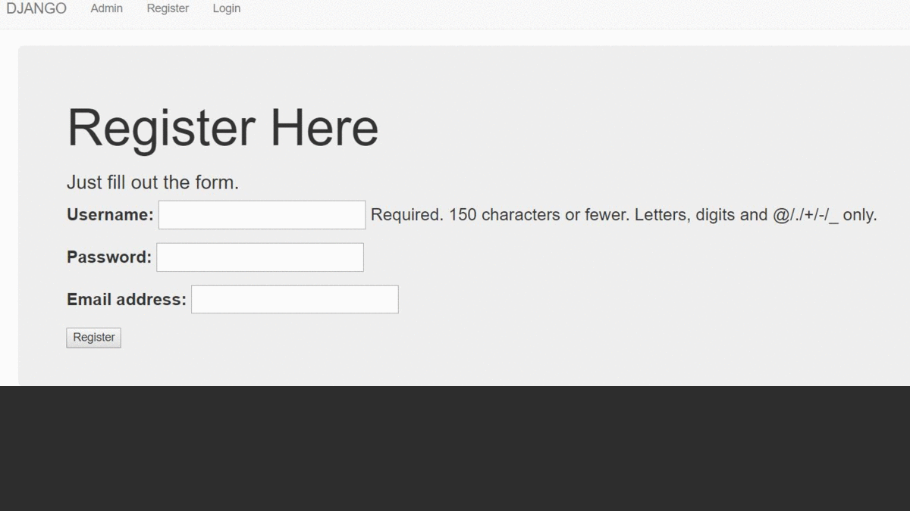

# Project Title

A web based platform to achieve following tasks

1. Time series analysis of variation of various available indexes used to analyse vegetation, water level etc using Landsat satellite data

2. Adding your own customised indices via a GUI

3. Visualizing terrain profile along a path using various available DEMs namely ASTER and SRTM

# Description
With each passing year, new generations of EO satellites are creating increasingly significant volumes of data with such comprehensive global coverage that for many applications, the lack of data is no longer a limiting factor. 
The data management and analysis challenges arising from the huge increase in free and open data volumes can be overcome with new computing infrastructures, technologies and data architectures, such as the “Open Data Cube”.

## Process overview



## Getting Started

These instructions will get you a copy of the project up and running on your local machine for development and testing purposes. See deployment for notes on how to deploy the project on a live system.

### Prerequisites

What things you need to install the software and how to install them

* [Open Data Cube](https://datacube-core.readthedocs.io/en/latest/) project 
* Landsat images of the region with corresponding metadata files (in .yaml format)


### Installing

1. Add conda forge channel

```sh
conda config --add channels conda-forge
```    

2. Create a virtualenv in conda
```sh
conda create --name cubeenv python=3.6 datacube
```
3. Activate environment

    ```python
    source activate cubeenv
    ```

4. Install other packages

    ```python
    conda install jupyter matplotlib scipy
    ```

5. Setting up database
* Install [PostgreSQL](https://sourceforge.net/projects/postgresqlportable/) portable launcher
* Create a user 
    `create role <username> superuser login`
* Create a database 
    `create database datacube`

6. Add config file and add it's path to DATACUBE_CONFIG_PATH environment variable
    
    ```
    [datacube]
    db_database: datacube

    # A blank host will use a local socket. Specify a hostname (such as localhost) to use TCP.
    db_hostname: 127.0.0.1

    # Credentials are optional: you might have other Postgres authentication configured.
    # The default username otherwise is the current user id.
    # db_username:  <your username>
    # db_password:  <your password>
    ```

To create username and password, open Postgres in terminal or Portable SQL Launcher and run following queries

```
create role <username> superuser login;
alter role <superuser> with password <password>
```

7. Add metadata types ( like eo, telemetry_data ) to the datacube using `datacube metadata add <path to your metadata types .yaml file>`

8. Add product definitions (It defines what type of products your datacube can hold.) using `datacube product add <path to your product definition yaml>`
    Examples of some [product definitions](https://github.com/opendatacube/datacube-core/tree/develop/docs/config_samples/dataset_types)

9. 
# DATA PREPARATION

The second step in the process is about extracting details from an individual satellite image. This is called the data preparation step. 
Scripts are available to extract information or metadata from many types of images. (metadata/MTL_MetadataTo_YAML.py, xmlToYaml.py)

The data extracted typically includes date and time of acquisition, spatial bounds, etc. as metadata. 

For each dataset add it's metadata file. At a minimum, you need the dimensions or fields your want to search by, such as lat, lon and time, but you can include any information you deem useful.
It is typically stored in YAML documents, but JSON is also supported. It is stored in the index for searching, querying and accessing the data.
For third party datasets https://datacube-core.readthedocs.io/en/latest/ops/prepare_scripts.html#prepare-scripts

In indexing step, metadata (documents) are indexed into the ODC’s database. Most importantly, the
process stores the location of the data within a local system. 

To index - 

```python
datacube dataset add <path to metadata.yaml of particular image>
```

10. Install all the requirements using 
    ```python
    pip install -r requirements.txt
    ```

11. Apply the migrations

    ```python
    python manage.py makemigrations
    python manage.py migrate
    ```
12. To run project

    ```python
    python manage.py runserver
    ```

## Querying the datacube
User-supplied query parameters are used as a lookup into the metadata database in order to determine which datasets hold data requested by the user. Those datasets are then grouped and ordered, and the actual data is loaded from the file system.
The resulting data is organized into an Xarray Dataset with appropriate temporal-spatial dimensions and separate data variables for each band.


## Authors

* **Harpinder Jot Singh** - [Github](https://github.com/HarpinderJotSingh) [LinkedIn](https://in.linkedin.com/in/harpinder-jot-singh-248b92155)
* **Kavya Gupta** - [Github](https://github.com/kavyagupta1107) [LinkedIn](https://in.linkedin.com/in/kavya-gupta-57530516b)

## Acknowledgments

* **Harish Chandra** [Profile](https://www.iirs.gov.in/Dr.Harish.C.Karnatak-profile) 
* Hat tip to anyone whose code was used
* StackOverflow :P


## Acronyms

- ARD                 Analysis Ready Data
- EO                  Earth Observation
- DB                  Database
- GDAL                Geospatial Data Abstraction Library
- GIS                 Geographic Information System
- NetCDF              Network Common Data Form
- ODC                 Open Data Cube
- USGS                United States Geological Survey

## Commit History Visualizer


[video](CommitHistoryVisualizer/DataCubeWebPlatform.mp4)

- Above video is made using 